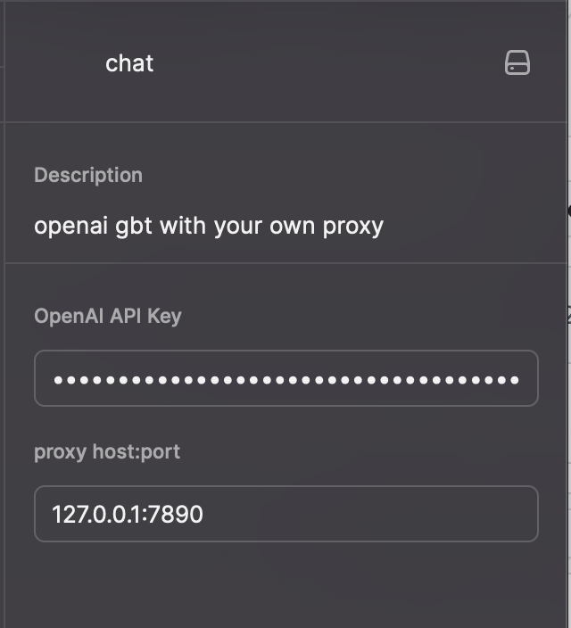
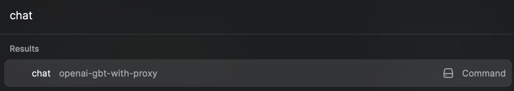
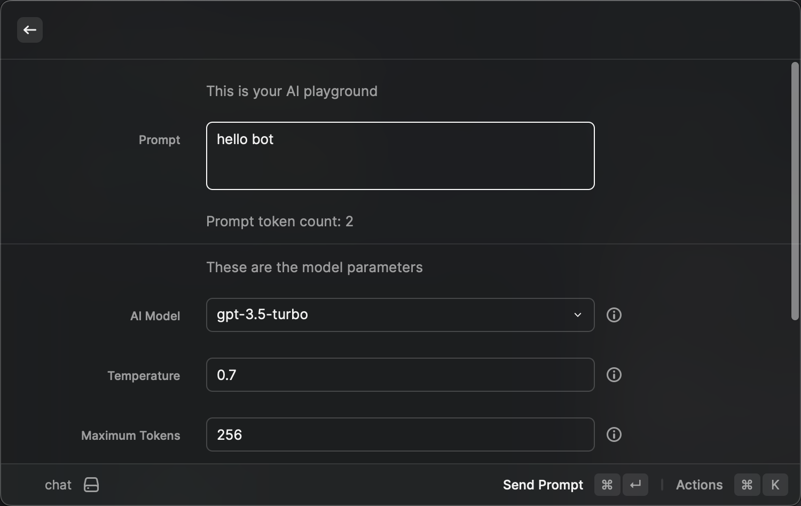
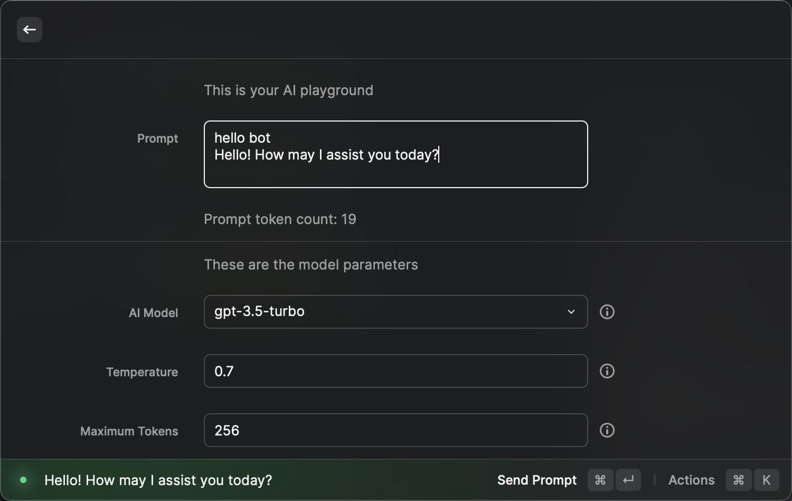

# Openai-Gbt-With-Proxy

> openai gbt with your own proxy in [Raycast ext](https://www.raycast.com/schemas/extension.json) base on [openai-gpt3](https://github.com/raycast/extensions/tree/main/extensions/openai-gpt3)

## How to use
### 1. configure your proxy and token

### 2. you can type in 'chat' cmd to use this ext

### 3. type in your prompt and send prompt

### 4. waiting for the result

